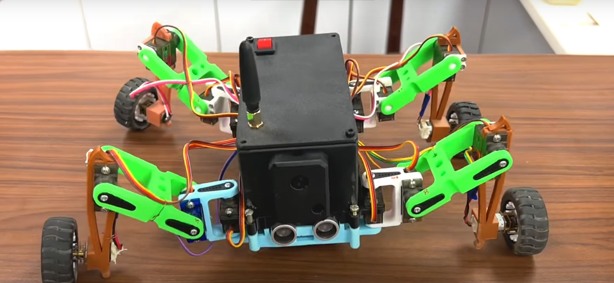

# Hybrid Quadruped Robot — 3D-Printed IK Locomotion


> A 3D-printed quadruped with on-board inverse kinematics — 12 servos, 4 DC motors, stable gait across uneven terrain.



---

## Overview

A fully custom quadruped robot built from scratch — the frame is designed in Fusion 360 and 3D-printed in PLA + TPU flex for the feet, the firmware runs FABRIK inverse kinematics on an ESP32 to compute joint angles in real-time, and the robot is hand-wired end to end.

**Hybrid drive** — servos handle leg articulation (3 DOF per leg), DC motors provide wheel assist on flat terrain for speed.

---

## Mechanical Design

- 4 legs × 3 DOF = **12 MG996R high-torque servos** (shoulder, upper, lower)
- 4 × N20 DC gear motors (wheel assist) driven by dual TB6612FNG
- Frame: Fusion 360 → 3D printed PLA (structure) + TPU 95A (feet)
- Print time: ~28 hours total across all parts
- Weight: ~1.1 kg complete

All STL/3MF files are in `cad/`.

---

## Inverse Kinematics — FABRIK

The robot uses **FABRIK** (Forward And Backward Reaching Inverse Kinematics) rather than analytical IK for two reasons:

1. FABRIK converges in O(n) iterations even for kinematic chains with joint limits
2. It extends naturally to terrain-following — each foot target is computed from a terrain height map sampled by IR sensors

```
Target foot position (x, y, z)
  ↓
FABRIK solver → joint angles (θ₁, θ₂, θ₃)
  ↓
PWM duty cycles → servo pulses via PCA9685
```

Solver runs at 50 Hz on one FreeRTOS core; gait pattern generator on the other.

---

## Gait Patterns

| Gait | Speed | Stability | Used when |
|------|-------|-----------|-----------|
| Crawl (1-3-2-4) | Slow | High | Rough terrain |
| Trot (diagonal pairs) | Medium | Medium | Default |
| Bound | Fast | Low | Flat, testing |

Gait pattern is auto-selected based on IMU (MPU6050) roll/pitch readings.

---

## Hardware

| Component | Detail |
|-----------|--------|
| Controller | ESP32 DevKit v1 |
| Servo driver | PCA9685 (I2C, 16-ch PWM) |
| Motor driver | TB6612FNG × 2 |
| IMU | MPU6050 (I2C) |
| Servos | MG996R × 12 |
| DC motors | N20 200RPM × 4 |
| Power | 2S LiPo 7.4V 3000 mAh |
| Voltage reg | LM2596 buck (5V for servos) |

---

## Firmware

```
firmware/
  ├── main.cpp           FreeRTOS entry, task spawn
  ├── ik/
  │   ├── fabrik.cpp     FABRIK solver
  │   └── leg.cpp        Leg geometry, joint limits
  ├── gait/
  │   ├── patterns.cpp   Crawl / trot / bound sequences
  │   └── scheduler.cpp  Gait phase timing
  ├── drivers/
  │   ├── pca9685.cpp    Servo PWM driver
  │   ├── tb6612.cpp     DC motor driver
  │   └── imu.cpp        MPU6050 fusion
  └── control/
      └── teleop.cpp     Bluetooth / serial remote control
```

---

## Build & Flash

```bash
git clone https://github.com/kavinjainn/hybrid-quadruped
cd hybrid-quadruped/firmware

# PlatformIO (recommended)
pio run --target upload

# Calibrate servos before first run
pio run --target upload -e calibrate
```

Print files: `cad/` — open in PrusaSlicer or Bambu Studio. Recommended: 40% infill for structural parts, 20% for covers.

---

## About

All mechanical design, 3D printing, wiring, and firmware by [Kavin Jain](https://kavinjain.in). Built in Udaipur, India.
